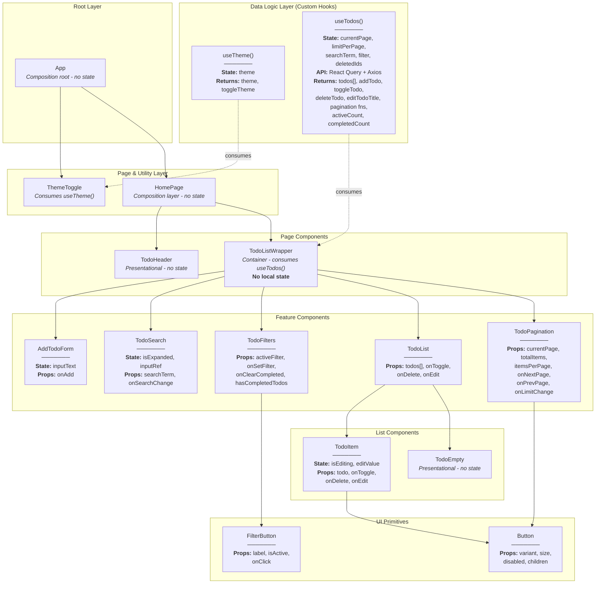

# Homework/Lab 4-6

This repository will be for works from 4 to 6 from my university React course.

## What needed to be done for homework #4:

_Create a Todo List app that uses a custom hook to handle all data fetching and state management for the todo items, utilizing a fake REST API that supports CRUD operations. The custom hook should abstract away the logic for fetching the todo list, adding new todos, updating existing ones, and deletim them, providing a clean interface to any component that needs todo data and functionality. + The Component Tree & Data Flow diagram._

## What needed to be done for homework #4:
_Extend the previous To-Do List application to include client-side search, pagination, and
editing of todo titles._

## Tech Stack

- [React](https://react.dev/)
- [React Query (_TanStack Query_)](https://tanstack.com/query/latest)
- [React Icons](https://react-icons.github.io/react-icons/)
- [Axios](https://axios-http.com/docs/intro)
- [TailwindCSS](https://tailwindcss.com/)

### Used Design Patterns

#### Core Patterns

**Custom Hook Pattern** - The most central pattern in the architecture. Created `useTodos` and `useTheme` hooks to encapsulate stateful logic and side effects into reusable functions. The `TodoListWrapper` component simply calls `useTodos()` to receive all necessary data and functions, abstracting away the complexity of React Query, API calls, and state management. This promotes code reusability and separation of concerns.

**Service Layer Pattern** - API communication logic is isolated into distinct async functions (`fetchAllTodos`, `updateTodoAPI`, `editTodoTitleAPI`, `deleteTodoAPI`). These functions act as a service layer that handles all interactions with the DummyJSON API. This decouples the application's business logic (managed by React Query in the custom hook) from the specific HTTP client (Axios), making the code more modular and testable.

**Container/Presentational Pattern** - Clear separation between "smart" components that manage state and logic, and "dumb" components that only render UI. `TodoListWrapper` is the smart container that fetches data and manages state. Components like `TodoItem`, `TodoHeader`, `TodoFilters`, `AddTodoForm`, and `TodoSearch` are presentational—they receive data and functions via props without knowing where the data originates.

**Unidirectional Data Flow** - State flows downward from parent to child via props (e.g., from `TodoListWrapper` to `TodoItem` via `TodoList`). State changes are communicated upward via callback functions (e.g., `onDelete` from `TodoItem` bubbles up to `TodoListWrapper`, which invokes the hook's `deleteTodo` function). This predictable flow makes debugging easier and prevents data synchronization issues.

**Component Composition Pattern** - The UI is built by composing smaller, focused components into larger structures. For example, `TodoListWrapper` composes `AddTodoForm`, `TodoSearch`, `TodoFilters`, `TodoList`, and `TodoPagination`. Each component has a single responsibility, making the codebase maintainable and testable.

#### Feature-Specific Patterns

**Optimistic UI Updates** - In the `useTodos` hook, the `onMutate` callback in `useMutation` immediately updates the React Query cache before the server responds. This makes the UI feel instantaneous and responsive. The `onError` callback provides a safety net to roll back changes if the server request fails, maintaining data consistency.

**Conditional Rendering** - Components use conditional rendering to adapt to different states. For example, `TodoList` renders `TodoEmpty` when `todos.length === 0`, and `TodoItem` switches between display mode and edit mode based on `isEditing` state.

**State Colocation** - Global server state (`todos`) is managed by React Query and accessed at the `TodoListWrapper` level. UI-specific state, like `inputText` in `AddTodoForm` or `isEditing` in `TodoItem`, is kept local to those components. This prevents unnecessary re-renders of the entire component tree when local UI state changes.

**Persistent State with useRef** - The `deletedIdsRef` uses `useRef` to maintain a Set of deleted IDs that persists across re-renders and React Query refetches. Unlike `useState`, `useRef` doesn't trigger re-renders when its value changes, making it ideal for tracking deletion state that should survive pagination changes.

**Derived State with useMemo** - Multiple `useMemo` hooks compute derived values like `todosWithoutDeleted`, `statusFilteredTodos`, `searchFilteredTodos`, and `paginatedTodos`. These memoized values only recalculate when their dependencies change, improving performance by avoiding unnecessary filtering operations on every render.

**Effect Synchronization** - `useEffect` hooks synchronize side effects with state changes. For example, when `searchTerm` or `filter` changes, an effect resets `currentPage` to 1. When `isExpanded` becomes true in `TodoSearch`, an effect focuses the input field.

**Compound Component Pattern (UI)** - The `Button` and `FilterButton` components accept configuration props to modify their appearance and behavior, acting as flexible building blocks for different use cases throughout the application.

### Component Tree & Data Flow diagram

#### Diagram

### Diagram Explained

#### Data Logic Layer (Custom Hooks)

**`useTheme()` Hook** - Manages theme state (light/dark mode) with a `theme` state variable. Returns `theme` and `toggleTheme()` function. Handles localStorage persistence for cross-session theme retention and directly manipulates the DOM by toggling the `dark` class on the `<html>` element.

**`useTodos()` Hook** - The central data management layer that encapsulates all todo-related business logic:
- **State Management**: Maintains `currentPage`, `limitPerPage`, `searchTerm`, `filter` ("all"/"active"/"done"), and `deletedIdsRef` (persistent Set for tracking deleted items across refetches)
- **API Integration**: Uses React Query with Axios to fetch all todos once (`limit=0`) and handle optimistic mutations (create, toggle, edit, delete)
- **Filtering Pipeline**: Applies filters in strict sequence: deletion filtering → status filtering → search filtering → client-side pagination
- **Optimistic Updates**: Implements immediate UI updates via `onMutate` callbacks with automatic rollback via `onError` if the server request fails
- **Returns**: Paginated `todos[]` array, CRUD action functions (`addTodo`, `toggleTodo`, `deleteTodo`, `editTodoTitle`), pagination controls (`goToNextPage`, `goToPrevPage`, `setLimit`), filter state (`filter`, `setFilter`), search state (`searchTerm`, `setSearchTerm`), and statistics (`activeCount`, `completedCount`)

#### Root Layer

**`App`** - The composition root and entry point. Renders the main layout structure with social media links (GitHub, LinkedIn) in the header, `ThemeToggle` button for theme switching, and `HomePage` component in the main content area. Holds no application state; purely structural.

#### Page & Utility Layer

**`ThemeToggle`** - A utility component that consumes the `useTheme()` hook. Displays a toggle button that allows users to switch between light and dark modes. Reflects the current theme state and invokes `toggleTheme()` on click.

**`HomePage`** - An intermediate composition layer that renders `TodoHeader` and `TodoListWrapper`. Separates page-level concerns from feature-specific logic. Holds no state; acts purely as a layout coordinator.

#### Page Components

**`TodoHeader`** - A presentational component displaying the application title. Rendered at the page level (in HomePage) rather than within the feature container, providing better semantic structure. Contains no state or logic.

**`TodoListWrapper`** - The primary smart/container component that consumes the `useTodos()` hook. Receives all data and functions from the hook and distributes them to child components via props. Holds no local state itself; follows the Container/Presentational pattern by acting as a pure orchestrator between the data layer and presentation layer. Handles the `clearCompleted` function locally by iterating through completed todos and calling `deleteTodo` for each.

#### Feature Components

**`AddTodoForm`** - A controlled form component with local `inputText` state for managing the input field. Receives `onAdd` callback as a prop. On form submission, validates the input and invokes `onAdd(text)`, sending the new todo text upward to `TodoListWrapper`, which then calls the hook's `addTodo` function.

**`TodoSearch`** - An expandable search input component with local state (`isExpanded` boolean, `inputRef` for focus management). Features click-to-expand animation that reveals the input field. Automatically focuses the input when expanded using `useEffect`. Receives `searchTerm` and `onSearchChange` props. Callbacks search term changes upward, triggering filtering in the `useTodos` hook.

**`TodoFilters`** - A filter control component displaying three filter buttons (All/Active/Done) and a conditional "Clear Completed" button. Receives `activeFilter`, `onSetFilter`, `onClearCompleted`, and `hasCompletedTodos` props. Uses the reusable `FilterButton` component for consistent active/inactive styling. Callbacks filter changes upward to update the hook's filter state.

**`TodoList`** - A list container component that receives the paginated and filtered `todos[]` array along with action callbacks (`onToggle`, `onDelete`, `onEdit`). Conditionally renders either a list of `TodoItem` components (mapped over the todos array) or the `TodoEmpty` component when the filtered list is empty. Passes all callbacks down to each `TodoItem`.

**`TodoPagination`** - A pagination control component displaying current page information ("Showing X-Y of Z items") and navigation controls. Receives `currentPage`, `totalItems`, `itemsPerPage`, `onNextPage`, `onPrevPage`, and `onLimitChange` props. Uses the generic `Button` component with `disabled` prop for Previous/Next buttons. Includes a dropdown select for changing items per page (5/10/20/30). Callbacks all navigation actions upward to update pagination state in the hook.

#### List Components

**`TodoItem`** - An individual todo list item component with local editing state (`isEditing` boolean, `editValue` string). Displays todo text with a checkbox for completion toggle. Features inline editing mode activated by clicking the "Edit" button, which transforms the text into an editable input field. Supports keyboard shortcuts (Enter to save, Escape to cancel). Uses `Button` components with different variants: primary for save, secondary for edit/cancel, danger for delete. Receives `todo` object and callbacks (`onToggle`, `onDelete`, `onEdit`) as props, invoking them when user actions occur.

**`TodoEmpty`** - A simple presentational component displayed when the filtered todo list is empty. Shows a friendly "No todos found" message. Contains no state or interactive elements.

#### UI Primitives (Reusable Components)

**`Button`** - A generic, reusable button component with configurable props: `variant` (primary/secondary/danger/ghost), `size` (sm/md/lg), `disabled` (boolean), and `children` (button content). Automatically handles disabled state styling with reduced opacity, cursor changes, and hover effect prevention. Used throughout the application for consistent button appearance and behavior.

**`FilterButton`** - A specialized button component for filter-style interactions. Receives `label` (string), `isActive` (boolean), and `onClick` (callback) props. Applies different styling based on the `isActive` state: dark background with light text when active, light background with dark text when inactive. Used in `TodoFilters` for the All/Active/Done buttons.