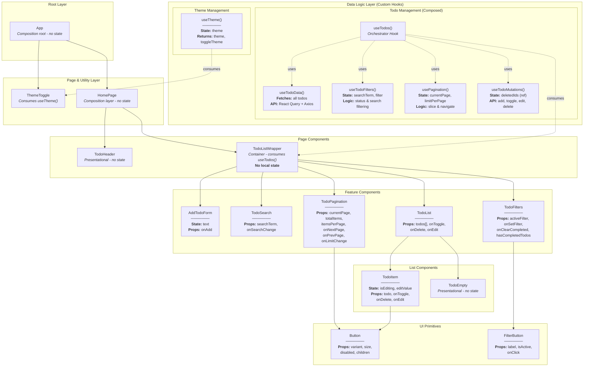

# Homework/Lab 4-7

This repository will be for works from 4 to 6 from my university React course.

## What needed to be done for homework #4:

_Create a Todo List app that uses a custom hook to handle all data fetching and state management for the todo items, utilizing a fake REST API that supports CRUD operations. The custom hook should abstract away the logic for fetching the todo list, adding new todos, updating existing ones, and deletim them, providing a clean interface to any component that needs todo data and functionality. + The Component Tree & Data Flow diagram._

## What needed to be done for homework #5 and #6:

_Extend the previous To-Do List application to include client-side search, pagination, and
editing of todo titles._

## What needed to be done for homework #7:
_Optimize application to minimize unnecessary re-renders by using React.memo, useCallback, useMemo without over-memoization. Identify perfomance bottlenecks using React DevTols Profiler and apply targeted optimizations to components and custom hooks._

## Tech Stack

- [React](https://react.dev/)
- [React Query (_TanStack Query_)](https://tanstack.com/query/latest)
- [React Icons](https://react-icons.github.io/react-icons/)
- [Axios](https://axios-http.com/docs/intro)
- [TailwindCSS](https://tailwindcss.com/)

### Used Design Patterns

#### Core Patterns

**Custom Hook Pattern** - The architectural foundation enabling stateful logic encapsulation and composition. The application employs four specialized hooks (`useTodoData`, `useTodoFilters`, `usePagination`, `useTodoMutations`) that are orchestrated by `useTodos()`. This orchestrator hook maintains a stable public interface while internally delegating data fetching to `useTodoData`, filtering logic to `useTodoFilters`, pagination to `usePagination`, and CRUD operations to `useTodoMutations`. The `TodoListWrapper` container consumes only the orchestrator hook, receiving a unified API that abstracts React Query complexity, API communication, and multi-layered state management. This promotes maximum code reusability, testability, and separation of concerns across the data logic layer.

**Service Layer Pattern** - API communication is fully decoupled from business logic through isolated async functions (`fetchAllTodos`, `updateTodoAPI`, `editTodoTitleAPI`, `deleteTodoAPI`). These functions form a service boundary between the application's data layer (managed by React Query within `useTodoData`) and the HTTP client implementation (Axios). The service layer is consumed exclusively by `useTodoData` for queries and `useTodoMutations` for mutations, ensuring all external API interactions flow through a single, testable abstraction.

**Container/Presentational Pattern** - Strict separation between stateful containers and stateless presentational components. `TodoListWrapper` acts as the smart container, orchestrating data fetching and state management through the `useTodos()` hook. All other components (`TodoItem`, `TodoHeader`, `TodoFilters`, `AddTodoForm`, `TodoSearch`, `TodoList`, `TodoPagination`) are presentational—they receive data and callbacks via props without knowledge of data origins or state management mechanisms. This architectural boundary enables component reusability, parallel development workflows, and focused unit testing strategies.

**Unidirectional Data Flow** - Data propagates downward from parent to child exclusively through props, while state mutations flow upward through callback functions. Props cascade from `TodoListWrapper` → `TodoList` → `TodoItem`, carrying todo data and action handlers. User interactions in child components trigger callbacks (e.g., `onDelete` from `TodoItem`) that bubble up to `TodoListWrapper`, which invokes the appropriate mutation function from `useTodoMutations`. This one-directional architecture eliminates bidirectional data binding complexities, creates predictable state transitions, and simplifies debugging by establishing clear data ownership boundaries.

**Component Composition Pattern** - The UI hierarchy is constructed by composing small, single-responsibility components into larger feature structures. `TodoListWrapper` composes six specialized components: `AddTodoForm` (input handling), `TodoSearch` (filtering by text), `TodoFilters` (status filtering), `TodoList` (item rendering), and `TodoPagination` (navigation controls). Each component owns a focused concern—`TodoList` handles mapping and conditional rendering, while `TodoItem` manages individual row display and inline editing. This compositional approach maximizes code maintainability, enables isolated testing, and facilitates incremental feature development.

#### Feature-Specific Patterns

**Optimistic UI Updates** - Mutations immediately update the React Query cache before server responses arrive, creating the perception of instantaneous interactions. The `useTodoMutations` hook implements `onMutate` callbacks that directly manipulate the query cache—adding new todos, toggling completion states, or filtering deleted items—before API calls resolve. Each mutation includes an `onError` rollback handler that restores the previous cache snapshot if the server request fails, maintaining data consistency despite optimistic assumptions. This pattern eliminates perceived latency for user actions like checkbox toggles and deletions, preventing "laggy" UI experiences and accidental double-clicks.

**Conditional Rendering** - Components dynamically adapt their output based on state conditions using ternary operators and early returns. `TodoList` renders `TodoEmpty` when `todos.length === 0` and maps over `TodoItem` components otherwise. `TodoItem` switches between read-only display mode and inline edit mode based on its local `isEditing` boolean state. This pattern enables adaptive UIs that respond to filtering, pagination, and user interactions without requiring separate component variants.

**State Colocation** - State is positioned at the most appropriate architectural layer based on scope and update frequency. Global server state (todos array) is managed by React Query at the `useTodoData` hook level and accessed via the `useTodos` orchestrator. UI-specific local state (`inputText` in `AddTodoForm`, `isEditing` in `TodoItem`, `isExpanded` in `TodoSearch`) remains scoped to individual components. This colocation strategy prevents unnecessary re-renders of the entire component tree when ephemeral UI state changes, as only the affected component re-renders.

**Persistent State with useRef** - The `deletedIdsRef` in `useTodoMutations` uses `useRef` to maintain a `Set<number>` of deleted IDs that persists across component re-renders and React Query refetches. Unlike `useState`, `useRef` mutations don't trigger re-renders, making it ideal for tracking deletion state that must survive pagination changes and cache invalidations. This ensures deleted items remain hidden even when navigating between pages or when the cache updates due to stale data refetches.

**Derived State with useMemo** - Multiple `useMemo` hooks in `useTodos` compute filtered and transformed data (`todosWithoutDeleted`, `statusFilteredTodos`, `searchFilteredTodos`, `paginatedTodos`) from source data. These memoized computations only recalculate when their dependency arrays change (e.g., `todos`, `searchTerm`, `filter`, `currentPage`), avoiding expensive array filtering operations on every render. This optimization is critical for maintaining 60fps rendering performance when handling large todo lists with multiple active filters.

**Effect Synchronization** - `useEffect` hooks coordinate side effects with state changes. When `searchTerm` or `filter` changes, a `useEffect` in `usePagination` resets `currentPage` to 1, preventing users from landing on empty pages after filtering narrows the result set. When `isExpanded` becomes `true` in `TodoSearch`, a `useEffect` imperatively focuses the input element using the stored `inputRef`, ensuring keyboard accessibility. These effects create declarative relationships between state changes and DOM interactions.

**Compound Component Pattern (UI)** - The `Button` and `FilterButton` components accept configuration props (`variant`, `size`, `disabled`, `isActive`) to modify appearance and behavior, functioning as flexible UI primitives reused throughout the application. This pattern centralizes styling logic and ensures consistent visual language across different interaction contexts.

### Component Tree & Data Flow diagram

#### Diagram

### Diagram Explained

#### Data Logic Layer (Custom Hooks)

#### Theme Management

**`useTheme()` Hook** - Manages theme state (light/dark mode) with a `theme` state variable. Returns `theme` and `toggleTheme()` function. Handles localStorage persistence for cross-session theme retention and directly manipulates the DOM by toggling the `dark` class on the `<html>` element.

#### Todo Management (Composed Hooks)

**`useTodos()` Hook (Orchestrator)** - The central coordinator that composes four specialized hooks to provide a complete todo management API. This orchestrator hook maintains the same public interface as before, making the refactoring transparent to consuming components. It chains together data fetching, filtering, pagination, and mutation operations to deliver a unified feature set.

**`useTodoData()` Hook** - Handles all API communication and data fetching:

- **API Integration**: Uses React Query with Axios to fetch all todos once (`limit=0`) from DummyJSON API
- **Query Configuration**: Sets `staleTime` to 5 minutes to reduce unnecessary refetches
- **Returns**: `allTodos` array, loading state, error messages, and `queryClient` instance for cache manipulation
- **Exports API Functions**: `fetchAllTodos`, `updateTodoAPI`, `editTodoTitleAPI`, `deleteTodoAPI` for use by mutation hooks

**`useTodoFilters()` Hook** - Manages search and status filtering logic:

- **State Management**: Maintains `searchTerm` (string) and `filter` (FilterType: "all"/"active"/"done")
- **Filtering Pipeline**: Applies filters in sequence: status filter (active/done/all) → search filter (case-insensitive text matching)
- **Statistics Calculation**: Computes `activeCount` and `completedCount` from the input todos array using memoized calculations
- **Returns**: Filter state, setters, filtered todos array, and statistics
- **Reusability**: Can be reused in any feature requiring similar filtering capabilities

**`usePagination()` Hook** - Implements client-side pagination with automatic page reset:

- **State Management**: Maintains `currentPage` (number) and `limitPerPage` (number, default 10)
- **Auto-Reset Logic**: Uses `useEffect` to reset to page 1 when dependencies change (e.g., search or filter changes)
- **Pagination Calculation**: Slices the input array based on current page and limit using `Array.slice()`
- **Navigation Functions**: Provides `goToNextPage`, `goToPrevPage`, and `setLimit` with boundary checks
- **Returns**: Current page info, paginated items, total counts, and navigation functions
- **Generic Design**: Accepts any array of items, making it reusable across different data types

**`useTodoMutations()` Hook** - Handles all CRUD operations with optimistic updates:

- **State Management**: Uses `useRef` with `Set<number>` to track deleted IDs persistently across renders
- **Optimistic Updates**: All mutations immediately update React Query cache via `onMutate` callbacks before API calls complete
- **Error Handling**: Implements rollback logic in `onError` callbacks to revert optimistic updates if API requests fail
- **CRUD Operations**:
  - `addTodo`: Creates new todo with timestamp ID, prepends to cache
  - `toggleTodo`: Flips completion status with optimistic UI update
  - `editTodoTitle`: Updates todo text with optimistic cache update
  - `deleteTodo`: Adds ID to deleted set, filters from cache, adjusts pagination if needed
- **Helper Function**: `filterDeletedTodos` removes locally deleted items from any todos array
- **Returns**: CRUD mutation functions and deletion filter function

#### Root Layer

**`App`** - The composition root and entry point. Renders the main layout structure with social media links (GitHub, LinkedIn) in the header, `ThemeToggle` button for theme switching, and `HomePage` component in the main content area. Holds no application state; purely structural.

#### Page \& Utility Layer

**`ThemeToggle`** - A utility component that consumes the `useTheme()` hook. Displays a toggle button that allows users to switch between light and dark modes. Reflects the current theme state and invokes `toggleTheme()` on click.

**`HomePage`** - An intermediate composition layer that renders `TodoHeader` and `TodoListWrapper`. Separates page-level concerns from feature-specific logic. Holds no state; acts purely as a layout coordinator.

#### Page Components

**`TodoHeader`** - A presentational component displaying the application title. Rendered at the page level (in HomePage) rather than within the feature container, providing better semantic structure. Contains no state or logic.

**`TodoListWrapper`** - The primary smart/container component that consumes the `useTodos()` orchestrator hook. Receives all data and functions from the composed hook system and distributes them to child components via props. Holds no local state itself; follows the Container/Presentational pattern by acting as a pure orchestrator between the data layer and presentation layer. Handles the `clearCompleted` function locally by iterating through completed todos and calling `deleteTodo` for each. Despite the internal hook refactoring, this component's implementation remains unchanged due to the stable `useTodos()` interface.

#### Feature Components

**`AddTodoForm`** - A controlled form component with local `text` state for managing the input field. Receives `onAdd` callback as a prop. On form submission, validates the input (checks for non-empty trimmed text) and invokes `onAdd(text)`, sending the new todo text upward to `TodoListWrapper`, which then calls the orchestrator hook's `addTodo` function (internally routed to `useTodoMutations`). Clears the input field by resetting state to an empty string after successful submission.

**`TodoSearch`** - A controlled input component that receives `searchTerm` and `onSearchChange` props. Contains no local state, making it a fully controlled component where the parent manages the search value. Features a full-width input field with a transparent background and bottom border that changes color on focus. Callbacks search term changes upward on every keystroke via the `onChange` handler, triggering filtering in the `useTodoFilters` hook (via `useTodos` orchestrator).

**`TodoFilters`** - A filter control component displaying three filter buttons (All/Active/Done) and a conditional "Clear Completed" button. Receives `activeFilter`, `onSetFilter`, `onClearCompleted`, and `hasCompletedTodos` props. Uses the reusable `FilterButton` component for consistent active/inactive styling. Callbacks filter changes upward to update the `useTodoFilters` hook's filter state (via `useTodos` orchestrator).

**`TodoList`** - A list container component that receives the paginated and filtered `todos[]` array along with action callbacks (`onToggle`, `onDelete`, `onEdit`). Conditionally renders either a list of `TodoItem` components (mapped over the todos array) or the `TodoEmpty` component when the filtered list is empty. Passes all callbacks down to each `TodoItem`.

**`TodoPagination`** - A pagination control component displaying current page information ("Showing X-Y of Z items") and navigation controls. Receives `currentPage`, `totalItems`, `itemsPerPage`, `onNextPage`, `onPrevPage`, and `onLimitChange` props. Uses the generic `Button` component with `disabled` prop for Previous/Next buttons. Includes a dropdown select for changing items per page (5/10/20/30). Callbacks all navigation actions upward to update the `usePagination` hook's state (via `useTodos` orchestrator).

#### List Components

**`TodoItem`** - An individual todo list item component with local editing state (`isEditing` boolean, `editValue` string). Displays todo text with a checkbox for completion toggle. Features inline editing mode activated by clicking the "Edit" button, which transforms the text into an editable input field. Supports keyboard shortcuts (Enter to save, Escape to cancel). Uses `Button` components with different variants: primary for save, secondary for edit/cancel, danger for delete. Receives `todo` object and callbacks (`onToggle`, `onDelete`, `onEdit`) as props, invoking them when user actions occur.

**`TodoEmpty`** - A simple presentational component displayed when the filtered todo list is empty. Shows a friendly "No todos found" message. Contains no state or interactive elements.

#### UI Primitives (Reusable Components)

**`Button`** - A generic, reusable button component with configurable props: `variant` (primary/secondary/danger/ghost), `size` (sm/md/lg), `disabled` (boolean), and `children` (button content). Automatically handles disabled state styling with reduced opacity, cursor changes, and hover effect prevention. Used throughout the application for consistent button appearance and behavior.

**`FilterButton`** - A specialized button component for filter-style interactions. Receives `label` (string), `isActive` (boolean), and `onClick` (callback) props. Applies different styling based on the `isActive` state: dark background with light text when active, light background with dark text when inactive. Used in `TodoFilters` for the All/Active/Done buttons.

#### Hook Composition Benefits

**Separation of Concerns** - Each specialized hook handles a single responsibility: data fetching (`useTodoData`), filtering (`useTodoFilters`), pagination (`usePagination`), or mutations (`useTodoMutations`).

**Reusability** - Hooks like `usePagination` and `useTodoFilters` are designed to work with any data type, making them reusable across different features.

**Testability** - Each hook can be tested independently with mock data and controlled inputs, improving test coverage and maintainability.

**Maintainability** - Changes to pagination logic don't affect filtering logic, and vice versa, reducing the risk of unintended side effects.

**Composability** - The orchestrator pattern (`useTodos`) demonstrates how complex features can be built by composing simpler, focused hooks.

**Stable Interface** - Despite internal refactoring, `useTodos` maintains the same public API, ensuring consuming components remain unchanged and backward compatible.
