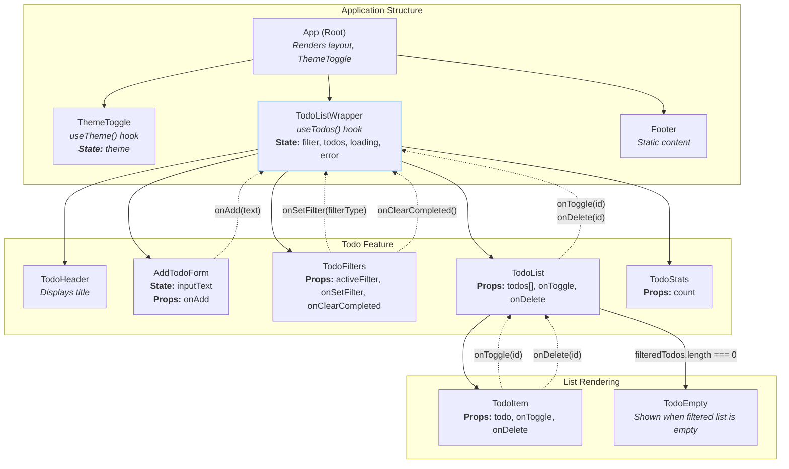

# Homework/Lab 4-6

This repository will be for works from 4 to 6 from my university React course.

## What needed to be done for homework #4:

_Create a Todo List app that uses a custom hook to handle all data fetching and state management for the todo items, utilizing a fake REST API that supports CRUD operations. The custom hook should abstract away the logic for fetching the todo list, adding new todos, updating existing ones, and deletim them, providing a clean interface to any component that needs todo data and functionality. + The Component Tree & Data Flow diagram._

## Tech Stack
- [React](https://react.dev/)
- [React Query (_TanStack Query_)](https://tanstack.com/query/latest)
- [React Icons](https://react-icons.github.io/react-icons/)
- [Axios](https://axios-http.com/docs/intro)
- [TailwindCSS](https://tailwindcss.com/)

### Used Design Patterns

#### Core Patterns

- **Custom Hook Pattern**: This is the most central pattern in the project. I created `useTodos` and `useTheme` to encapsulate stateful logic into reusable functions. My `TodoListWrapper` component simply calls `useTodos()` to get all the data and functions it needs, abstracting away the implementation details of the underlying data-fetching stack.
- **Service Layer Pattern**: The API communication logic is isolated into a set of distinct, async functions (`fetchTodos`, `deleteTodoAPI`, etc.). These functions act as a "service layer" that handles all interactions with the external API. This decouples the application's business logic (managed by React Query in the custom hook) from the specific HTTP client (Axios), making the code more modular and easier to maintain.
- **Container/Presentational Pattern**: I've separated "smart" components that manage state and logic from "dumb" components that just display data. E.g. `TodoListWrapper` (smart) is the container. It fetches data, manages filter state, and holds all handler functions. `TodoItem`, `TodoHeader`, `TodoFilters`, and `AddTodoForm` are presentational. They receive data and fucntions via props and are not concerned with where the data comes from.
- **Unidirectional Data Flow**: State flows down from parent to child via props (e.g., from `TodoListWrapper` to `TodoItem`), and changes are communicated back up via callback functions (e.g., `onDelete` from `TodoItem` to `TodoListWrapper`).
- **Repository Pattern (Avoided)**: For this project, a formal Repository Pattern was considered over-engineering. My custom hook (`useTodos`) already provides a sufficient layer of abstraction between the UI and the data source. Introducing a `TodoRepository` class would add unnecessary complexity without providing significant benefits for a single-source API.

#### Feature-Specific Patterns

- **Optimistic UI Updates**: In `useTodos` custom hook, the `onMutate` function in `useMutation` immediately updates the local cache before the server has responded. This makes the UI feel instantaneous. The `onError` function provides a safety net to roll back the change if the server request fails.
- **Conditional Rendering**: E.g. the `TodoList` component renders the `TodoEmpty` component only when the `filteredTodos` array is empty.
- **State Colocation**: Global server state (`todos`) is managed by React Query and lifted to the `TodoListWrapper`. UI-specific state, like the input text in `AddTodoForm`, is kept local to that component, preventing unnecessary re-renders of the entire app.

### Component Tree & Data Flow diagram

#### Diagram

#### Diagram Explained
- **App**: The composition root. It renders the main layout, including the ThemeToggle, TodoListWrapper, and Footer. It holds no application state.
- **ThemeToggle**: Uses a useTheme hook to toggle the dark class on the <html> element and persists the choice in localStorage.
- **TodoListWrapper**:
  - This is the primary "smart" component.
  - It calls the useTodos() custom hook to get the todos array, loading/error states, and action functions (addTodo, toggleTodo, deleteTodo).
  - It manages the local filter state ('all', 'active', 'done').
  - **Data Down**: It passes addTodo to AddTodoForm.
  - **Data Down**: It passes the filteredTodos array, toggleTodo, and deleteTodo to the TodoList component.
  - **Data Down**: It passes filter state and control functions (activeFilter, onSetFilter, onClearCompleted) to TodoFilters.
- **AddTodoForm**:
  - A "dumb" component that receives onAdd as a prop.
  - **Callback Up**: On form submission, it invokes onAdd(newTodoText), sending the new task's content up to be handled by the useTodos hook.
- **TodoFilters**:
  - Receives the current filter and functions to change it.
  - **Callback Up**: Invokes onSetFilter(filterType) when a filter button is clicked.
  - **Callback Up**: Invokes onClearCompleted() when the "Clear" button is clicked.
- **TodoList**:
  - Receives the filteredTodos array.
  - If the array is empty, it conditionally renders the TodoEmpty component.
  - Otherwise, it maps over the array and renders a TodoItem for each todo, passing down the todo object and the onToggle and onDelete callbacks.
- **TodoItem**:
  - Displays a single todo.
  - **Callback Up**: Invokes onToggle(todo.id) when its checkbox is clicked.
  - **Callback Up**: Invokes onDelete(todo.id) when its delete button is clicked
