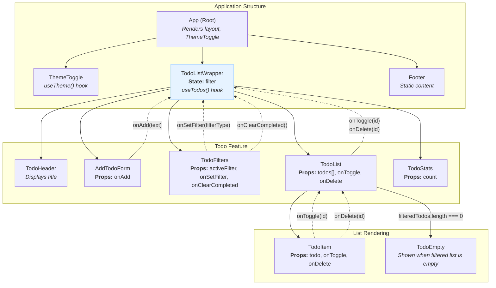

# Homework/Lab 4-6

This repository will be for works from 4 to 6 from my university React course.

## What needed to be done for homework #4:

_Create a Todo List app that uses a custom hook to handle all data fetching and state management for the todo items, utilizing a fake REST API that supports CRUD operations. The custom hook should abstract away the logic for fetching the todo list, adding new todos, updating existing ones, and deletim them, providing a clean interface to any component that needs todo data and functionality. + The Component Tree & Data Flow diagram._

### Component Tree & Data Flow diagram

#### Diagram

#### Diagram Explained
- **App**: The composition root. It renders the main layout, including the ThemeToggle, TodoListWrapper, and Footer. It holds no application state.
- **ThemeToggle**: Uses a useTheme hook to toggle the dark class on the <html> element and persists the choice in localStorage.
- **TodoListWrapper**:
  - This is the primary "smart" component.
  - It calls the useTodos() custom hook to get the todos array, loading/error states, and action functions (addTodo, toggleTodo, deleteTodo).
  - It manages the local filter state ('all', 'active', 'done').
  - **Data Down**: It passes addTodo to AddTodoForm.
  - **Data Down**: It passes the filteredTodos array, toggleTodo, and deleteTodo to the TodoList component.
  - **Data Down**: It passes filter state and control functions (activeFilter, onSetFilter, onClearCompleted) to TodoFilters.
- **AddTodoForm**:
  - A "dumb" component that receives onAdd as a prop.
  - **Callback Up**: On form submission, it invokes onAdd(newTodoText), sending the new task's content up to be handled by the useTodos hook.
- **TodoFilters**:
  - Receives the current filter and functions to change it.
  - **Callback Up**: Invokes onSetFilter(filterType) when a filter button is clicked.
  - **Callback Up**: Invokes onClearCompleted() when the "Clear" button is clicked.
- **TodoList**:
  - Receives the filteredTodos array.
  - If the array is empty, it conditionally renders the TodoEmpty component.
  - Otherwise, it maps over the array and renders a TodoItem for each todo, passing down the todo object and the onToggle and onDelete callbacks.
- **TodoItem**:
  - Displays a single todo.
  - **Callback Up**: Invokes onToggle(todo.id) when its checkbox is clicked.
  - **Callback Up**: Invokes onDelete(todo.id) when its delete button is clicked